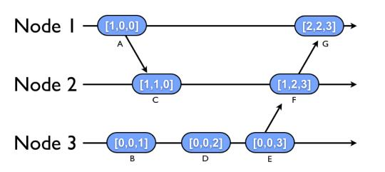

# CS4545 Distributed Algorithms Lab


This code is offered as a template for the course CS4545.
This template is tested on Ubuntu 20.04 (should also work on Windows and Mac OSX).
NOTE: When running locally Python >= 3.8  is required.

## Docs

- IPv8 ([ipv8-docs](https://py-ipv8.readthedocs.io/en/latest/index.html)).
- Asyncio ([docs](https://docs.python.org/3/library/asyncio.html)) is heavily used for the implementation of this code.

## File structure
- **cs4545:** Holds all the python source files
- **cs4545/ implementation:** Contains code for different distributed algorithms
- **topologies/default.yaml:** List of the addresses of all the processes that are participating in the algorithm.
- **Dockerfile:** Dockerfile describing the image that is used by docker-compose
- **docker-compose.yml:** Yaml file that describes the system for docker-compose.
- **docker-compose.template.yml:** Yaml file used as a template for the `src/util.py` script.

## Topology File
The topology file (in `./topologies`) is used to define how the nodes in the system are connected.
The yaml file is a list of node ids with the corresponding connections to other nodes.
To increase the number of nodes in a topology, run the `util.py` script.
By default, `util.py` creates a ring topology. If you want/need to use another topology (fully-connected, parse network, ...), adjust the script.
To run the util script `python -m cs4545.system.util compose <num-nodes> <topology-file> <algorithm-name>`


## Remarks

1. Feel free to change any of the files. This template is offered as starting point with working messaging between distributed processes.
2. Be sure to adjust the topology based on the assignment. By default, `util.py` creates a ring topology. If you want/need to use another topology (fully-connected, parse network, ...), adjust the script.


## Prerequisites

- Docker
- Docker-compose
- (Python >= 3.8 if running locally)

Install dependencies:

```bash
pip install -r requirements.txt
```

Expected output is the same as when running with docker-compose.

## Assignment 1

The fully-connected topology file is provided manually temporarily. To run the dolev algorithm, run:

```bash
python -m cs4545.system.util compose 10 topologies/dolev.yaml dolev
docker compose build
docker compose up
```


## Examples Docker

### Echo algorithm

```bash
python -m cs4545.system.util compose 2 topologies/echo.yaml echo --overwrite_topology
docker compose build
docker compose up
```

Expected output:

```text
node0-1  | [Node 0] booting on 192.168.56.10
node1-1  | [Node 1] booting on 192.168.56.11
node1-1  | [Node 1] is ready
node0-1  | Node 0 is starting the algorithm
node0-1  | [Node 0] is ready
node1-1  | [Node 1] Got a message from node: 0.  current counter: 1
node0-1  | [Node 0] Got a message from node: 1.  current counter: 2
node1-1  | [Node 1] Got a message from node: 0.  current counter: 3
node0-1  | [Node 0] Got a message from node: 1.  current counter: 4
node1-1  | [Node 1] Got a message from node: 0.  current counter: 5
node0-1  | [Node 0] Got a message from node: 1.  current counter: 6
node1-1  | [Node 1] Got a message from node: 0.  current counter: 7
node0-1  | [Node 0] Got a message from node: 1.  current counter: 8
node1-1  | [Node 1] Got a message from node: 0.  current counter: 9
node0-1  | Node 0 is stopping
node0-1  | [Node 0] Got a message from node: 1.  current counter: 10
node0-1  | [Node 0] Stopping algorithm
node0-1  | [Node 0] Algorithm output saved to output/node-0.out in /home/python/output/node-0.out
node0-1  | [Node 0] Node stats saved to output/node-0.yml in /home/python/output/node-0.yml
node1-1  | Node 1 is stopping
node1-1  | [Node 1] Got a message from node: 0.  current counter: 11
node1-1  | [Node 1] Stopping algorithm
node1-1  | [Node 1] Algorithm output saved to output/node-1.out in /home/python/output/node-1.out
node1-1  | [Node 1] Node stats saved to output/node-1.yml in /home/python/output/node-1.yml

```

### Ring Election algorithm

```bash
python -m cs4545.system.util compose 4 topologies/election.yaml ring --overwrite_topology
docker compose build
docker compose up
```

Expected output:

```text
node3-1  | [Node 3] booting on 192.168.56.13
node1-1  | [Node 1] booting on 192.168.56.11
node2-1  | [Node 2] booting on 192.168.56.12
node0-1  | [Node 0] booting on 192.168.56.10
node0-1  | [Node 0] Starting by selecting a node: 3
node3-1  | [Node 3] Got a message from with elector id: 0
node2-1  | [Node 2] Got a message from with elector id: 3
node1-1  | [Node 1] Got a message from with elector id: 3
node0-1  | [Node 0] Got a message from with elector id: 3
node3-1  | [Node 3] Got a message from with elector id: 3
node3-1  | [Node 3] we are elected!
node3-1  | [Node 3] Sending message to terminate the algorithm!
node2-1  | [Node 2] Stopping algorithm
node2-1  | [Node 2] Algorithm output saved to output/node-2.out in /home/python/output/node-2.out
node2-1  | [Node 2] Node stats saved to output/node-2.yml in /home/python/output/node-2.yml
node1-1  | [Node 1] Stopping algorithm
node1-1  | [Node 1] Algorithm output saved to output/node-1.out in /home/python/output/node-1.out
node1-1  | [Node 1] Node stats saved to output/node-1.yml in /home/python/output/node-1.yml
node0-1  | [Node 0] Stopping algorithm
node0-1  | [Node 0] Algorithm output saved to output/node-0.out in /home/python/output/node-0.out
node0-1  | [Node 0] Node stats saved to output/node-0.yml in /home/python/output/node-0.yml
node3-1  | [Node 3] Stopping algorithm
node3-1  | [Node 3] Algorithm output saved to output/node-3.out in /home/python/output/node-3.out
node3-1  | [Node 3] Node stats saved to output/node-3.yml in /home/python/output/node-3.yml
node2-1 exited with code 0
node3-1 exited with code 0
node0-1 exited with code 0
node1-1 exited with code 0
```

## Examples local

Expected output is the same as when running with docker-compose.

### Echo algorithm

```bash
python -m cs4545.system.run 0 topologies/echo.yaml echo &
python -m cs4545.system.run 1 topologies/echo.yaml echo &
```

### Ring Election algorithm

```bash
python -m cs4545.system.run 0 topologies/election.yaml echo &
python -m cs4545.system.run 1 topologies/election.yaml echo &
python -m cs4545.system.run 2 topologies/election.yaml echo &
python -m cs4545.system.run 3 topologies/election.yaml echo &
```


## Errors F.A.Q.

- **PermissionError: [Errno 13] Permission denied: 'output/...**
This can happen if you run docker first and then run locally. The docker daemon uses root access and can alter the ownership of some folders.
On Linux/Macos you can change the folder ownership with `sudo chown -R $USER:$USER output`.
- **ERROR: Pool overlaps with other one on this address space***
There already exists a docker network with the same network space. Try removing a docker network using `docker network rm [network_name]` or change the address space in the file `docker-compose.template.yml`